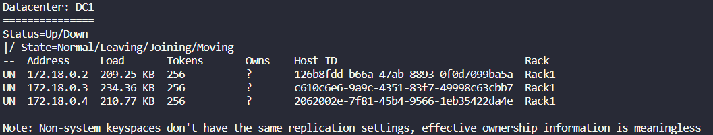

# ScyllaDB and Go
Using ScyllaDB with Go.

<div align="center">
➡️ 👷🚧 <b>Under Construction...</b>
</div>

## Technologies
- [ScyllaDB]
- [Golang]
- [gocql]
- [gocqlx]
- [govalidator]

### goclq
`gocql` is the driver to use ScyllaDB with Golang.

### goclqx
`gocqlx` is a wrapper for gocql that provides developer productivity without sacrificing performance.


## Installation
Firstly, be sure to have both [Docker], [Docker Compose] and [Golang] installed.

Git clone this repository:
```bash
git clone https://github.com/Guilospanck/scylladb-and-go.git
```
Change directory into it:
```bash
cd scylladb-and-go/
```
Then put Scylla cluster UP by using docker-compose:
```bash
# docker compose v1
sudo docker-compose -f docker-compose.yml up -d --build

# docker compose v2
sudo docker compose -f docker-compose.yml up -d --build
```
After some time (may take really some time, like 5min total) you'll be able to have a Scylla cluster up and running. To verify that:
```bash
sudo docker exec -it scylla-node1 nodetool status
```
You should see something like:
<div align="center">  
    
</div>

> Sometimes you may see some error like "Could not connect. Connection refused". In order to change that, do:
```bash
sudo nano /etc/sysctl.conf

# Then add this line at the end of the file
fs.aio-max-nr = 1048576

# save it and to activate the config
sudo sysctl -p /etc/sysctl.conf

# after that, kill the containers and put them up again:
sudo docker-compose kill
sudo docker-compose rm -f
sudo docker-compose -f docker-compose.yml up -d --build
```
---

## How to use the application
Once you have all the above section setted up, follow this one.

### Running the Go HTTPS server
Change directory into the project directory
```bash
cd scylladb-and-go/
```
And then run
```bash
go run .
```

### Queries
Using `gocqlx` to create our queries we have the following:
```go
type T any

type IQueryBuilder[t T] interface {
	Insert(insertData *t) error
	Delete(dataToBeDeleted *t) error
	DeleteAllFromPartitioningKey(dataToBeDeleted *t) error
	Select(dataToGet *t) ([]t, error)
	Get(dataToGet *t) ([]t, error)
	SelectAll() ([]t, error)
}
```

- `Insert`: will insert a new item into the database
- `Delete`: will delete an item based on the Primary Key (Partitioning Key + Clustering Key)
- `DeleteAllFromPartitioningKey`: will delete an item based on the Partitioning Key
- `Select`: will return data based on the Partitioning Key
- `Get`: will return data based on the Primary Key (PK + CK)
- `SelectAll`: will return all data from table

### Making requests
You can use either the simple `curl` function or the `Insomnia` program.
> If using Insomnia, be sure to go to Applications > Preferences and then uncheck "Validate certificates" under "Request/Response" section. This is needed in order to make requests to the HTTPS localhost.

- Insert tracking data
  - curl
    ```bash
    curl --location --request POST 'https://localhost:4444/api/v1/tracking' \
    --header 'Content-Type: application/json' \
    --data-raw '{
        "firstName": "Post",
        "lastName": "Test",
        "timestamp": "2022-04-10 09:10:00 +0000 UTC",
        "location": "Brazil",
        "speed": 10,
        "heat": 25,
        "telepathyPowers": 222
    }'
    ```
  - Insomnia: run `Insert tracking data`

- Delete tracking data by Primary Key (Partition Key + Clustering Key)
  - curl
    ```bash
    curl --location --request DELETE 'https://localhost:4444/api/v1/tracking' \
    --header 'Content-Type: application/json' \
    --data-raw '{
        "firstName": "Post",
        "lastName": "Test",
        "timestamp": "2022-04-10 09:10:00 +0000 UTC"
    }'
    ```
  - Insomnia: run `Delete tracking data by Primary Key`

- Delete all tracking data by Partition Key
  - curl
    ```bash
    curl --location --request DELETE 'https://localhost:4444/api/v1/tracking/bypartition' \
    --header 'Content-Type: application/json' \
    --data-raw '{
        "firstName": "Post",
        "lastName": "Test"
    }'
    ```
  - Insomnia: run `Delete all tracking data by Partition Key`

- Get tracking data by Primary Key
  - curl
    ```bash
    curl --location --request GET 'https://localhost:4444/api/v1/tracking' \
    --header 'Content-Type: application/json' \
    --data-raw '{
        "firstName": "Post",
        "lastName": "Test",
        "timestamp": "2022-04-10 09:10:00 +0000 UTC"
    }'
    ```
  - Insomnia: run `Get by Primary Key`

- Get all tracking data by Partition Key
  - curl
    ```bash
    curl --location --request GET 'https://localhost:4444/api/v1/tracking/bypartition' \
    --header 'Content-Type: application/json' \
    --data-raw '{
        "firstName": "Post",
        "lastName": "Test"
    }'
    ```
  - Insomnia: run `Get All by Partition Key`

[Docker]: https://www.digitalocean.com/community/tutorials/how-to-install-and-use-docker-on-ubuntu-20-04
[Docker Compose]: https://www.digitalocean.com/community/tutorials/how-to-install-and-use-docker-compose-on-ubuntu-20-04
[Golang]: https://go.dev/dl/
[govalidator]: https://github.com/go-playground/validator
[gocqlx]: https://github.com/scylladb/gocqlx
[gocql]: https://github.com/scylladb/gocql
[ScyllaDB]: https://www.scylladb.com/
